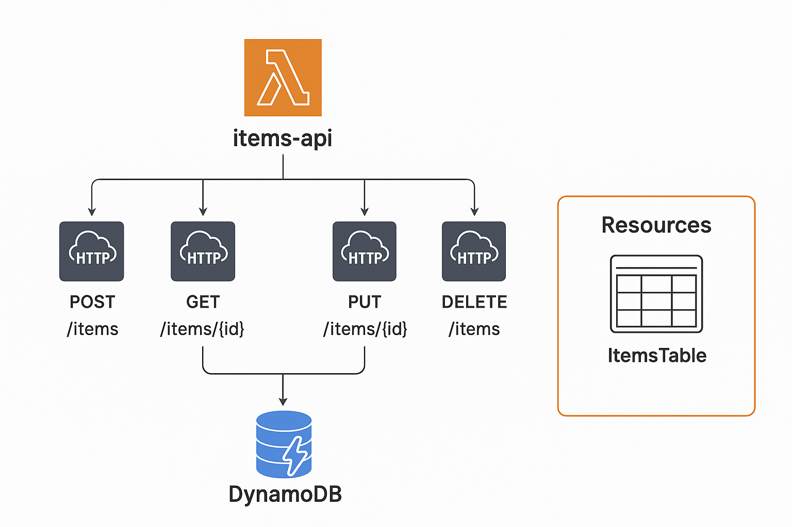

Vídeo en Loom

https://www.loom.com/share/7139aeff97f64a608cb502a8602d103c?sid=3a9db893-47c9-4738-b568-1b92dbc1e818

Nodejs
Construcción del proyecto
npm init -y
Intalar nodejs
npm install

Instalar dependencias
npm install serverless serverless-offline serverless-dynamodb-local --save-dev

Serverless 4 
Create Access Key

Loguearse a Serverless

npx serverless login

npm install @jest/globals@30.1.2 --save-dev
npm install rxjs@latest
npm test

Cobertura de test 

Installar en Docker el DynamoDB local para pruebas locales

docker run -d --name dynamodb-local  -p 8000:8000 amazon/dynamodb-local

Instalar 
AWS Cli V2

Creación tabla local en dynamodb

aws dynamodb create-table --table-name ItemsTable --attribute-definitions AttributeName=id,
AttributeType=S --key-schema AttributeName=id,KeyType=HASH --billing-mode PAY_PER_REQUEST --endpoint-url http://localhost:8000 --region us-east-1

Para probar local

npx serverless offline start

Levantar API local
npx serverless offline
Starting Offline at http://localhost:3000

Collections Postman Test

Opciones de Postman

Create Item
Add item

Duplicate item

Update Item

Update ok

item no exist

Delete Item
Ok

item not found

Get Item
Ok

Item not found

List Items

DynamoDB 

Templates de CloudFormation

IAC

Cuando se haga commit se dispare el pipeline automáticamente

Contrucción del proyecto buildspec

Contrucción de Tabla de DynamoDB y el Bucket S3

Para disparar los pipelines automáticos desde .github/workflows/trigger-pipeline.ymal:

En tu repositorio GitHub → Settings > Secrets and variables > Actions:

Configura:

AWS_ACCESS_KEY_ID

AWS_SECRET_ACCESS_KEY

Tus CodePipelines ya deben existir en AWS con los nombres:

Dentro de pipeline.yaml ya existen estos pipelines internos

DeploymentPipelineDev

DeploymentPipelineTest

DeploymentPipelineProd

Cada vez que hagas git push origin dev (o test, o main) → se disparará el pipeline correcto en AWS automáticamente.

Api 

Donde se encuentra el apiGateway y las funciones lambda de nodejs

Arquitectura Serverless

InfraEstructura CRUD aws

Como ejecutar el deploy-infra.yaml que es la infractura

Manualmente:

sls deploy --stage %STAGE% -c templates/deploy-infra.yaml

Automáticamente ejecutando estos archivos bat así

deploy-infra.bat dev
deploy-infra.bat test
deploy-infra.bat prod

Pipeline

Construye el proyecto y despliega la aplicación

La información de la IAC los templates se encuentran en la carpeta /template, en la raíz pipeline.yaml y en .github/workflows deploy.yaml que es el que dispara todo el proceso
automático cuando se hace commit.

